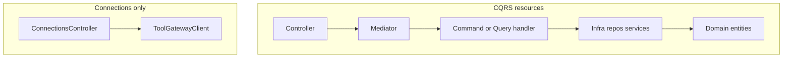

# Studio Agents platform (frontend + backend)

## When to use

Apply when work touches the **Studio Agents platform** in **`apps/studio-frontend`** (screens, hooks, BFF) **and/or** **`apps/studio-backend`** (REST handlers, CQRS, persistence, infra). For route maps, hook index, API keys, and **backend controller/entity tables**, read [reference.md](reference.md).

## Mental model (frontend)

1. **Route file** (`app/(app)/<area>/.../page.tsx`) — thin wrapper: feature component, sometimes `RequirePermission` or `Suspense`.
2. **Feature code** (`features/agents-platform`, `features/inbox`, `features/runs`, `features/evals`, `features/approvals`, `features/connections`, `features/settings`).
3. **Browser HTTP** — `apiClient` + `API_ROUTES.agentsPlatform` (`lib/api/api-routes.ts`); do not hardcode `/api/agents-platform/...`.
4. **BFF** — `app/api/agents-platform/**/route.ts` → `services/studio-backend/operations/agents-platform/*` with session and tenant context.
5. **SDK** — `@agorareal/studio-backend-client-sdk` used by operations; maps to **`v1/...`** routes on studio-backend.

```mermaid
flowchart LR
  subgraph browser [Browser]
    R[app/(app) routes]
    F[features/*]
    H[SWR hooks]
    AC[apiClient + API_ROUTES]
  end
  subgraph next [Next.js]
    BFF[app/api/agents-platform]
    Ops[services/studio-backend/operations/agents-platform]
    SDK[studio-backend-client-sdk]
  end
  subgraph be [studio-backend]
    C[HTTP controllers v1]
  end
  R --> F
  F --> H
  H --> AC
  AC --> BFF
  BFF --> Ops
  Ops --> SDK
  SDK --> C
```

## Mental model (studio-backend)

- **Module root**: [`apps/studio-backend/src/studio-backend.module.ts`](apps/studio-backend/src/studio-backend.module.ts) — registers **controllers**, **CommandHandlers** / **QueryHandlers** (via `Mediator`), middleware, `TenantTransactionInterceptor`, and infra (`sequelizeProvider`, `ToolGatewayClient`, `MemoryServiceClient`, `WorkflowBridgeService`, `ApprovalExpiryScheduler`, `EvalRunnerService`, `RunsGateway`, …).
- **HTTP**: Controllers under `src/api/controllers/` with `@Controller('v1/...')`. OpenAPI operation IDs feed **`@agorareal/studio-backend-client-sdk`**.
- **CQRS**: `src/application/<domain>/` — `commands/<action>-<entity>/`, `queries/<name>/`, each with handler + request/response DTOs.
- **Persistence**: `src/domain/entities/` (Sequelize) — see [reference.md](reference.md) for agents-platform entities vs **connections** (no local connection entity; proxy to tool-gateway).



- **Cross-cutting**: `TenantMiddleware`, `UserMiddleware` — `req.tenantId`, `req.userId` on requests.
- **Runs**: [`RunsController`](apps/studio-backend/src/api/controllers/runs/runs.controller.ts) — lifecycle, events (including SSE patterns); `RunsGateway` for realtime — read implementation rather than duplicating protocol details here.

## Quick map (areas → feature package)

| URL prefix | Primary feature folder | Role |
|------------|------------------------|------|
| `/agents` | `features/agents-platform` | Agent list, builder (with tools, triggers), versions, publish |
| `/skills` | `features/agents-platform` | Skill list, builder, versions, publish/archive |
| `/tools` | `features/agents-platform` | Tool list, create, detail, test panel |
| `/tasks` | `features/agents-platform` | Task definition list, builder |
| `/inbox` | `features/inbox` | Thread-based runs + approvals (list + thread); `/runs` and `/approvals` redirect here |
| `/runs/[id]` | `features/runs` | Run detail, events, timeline (deep link) |
| `/runs/conversations/[conversationId]` | `features/runs` | Conversation view (deep link) |
| `/approvals/[id]` | `features/approvals` | Approval detail (deep link) |
| `/evals` | `features/evals` | Eval suites, eval run detail (dev-only sidebar) |
| `/connections` | `features/connections` | Connections list, detail, dialogs |
| `/settings` | `features/settings` | Tenant settings (policy, models, etc.) |

**Nav neighbors** (other Studio product areas): Chat, Ask My Data, Deep Agents, Flows, Spaces — out of scope unless integrating with agents platform.

## Changing data flow (checklist)

1. **Types** — DTOs from `@/services/studio-backend/operations/agents-platform` (SDK re-exports); align with **`apps/studio-backend`** command/query DTOs.
2. **`API_ROUTES`** — `lib/api/api-routes.ts` → `agentsPlatform.*`.
3. **BFF** — `app/api/agents-platform/.../route.ts`.
4. **Operations** — `operations/agents-platform/<domain>.ts`.
5. **Backend** — If the contract changes, update the **Nest controller** + **handler** + sometimes **entity** in `apps/studio-backend`; regenerate SDK if needed.
6. **Hooks** — SWR keys and `mutate` helpers in feature hooks (`create-entity-hooks` pattern).
7. **UI** — Wire through `features/*`.

## Permissions (three layers)

1. **Sidebar** — `lib/navigation/nav-config.ts` + `useNavItems`.
2. **Capabilities** — `useAgentPermissions` (`features/agents-platform/hooks/use-agent-permissions.ts`).
3. **Page gate** — `RequirePermission` for specific `canEdit*` flags, `canViewInbox` for inbox routes.

## Shared UI patterns (frontend)

- **BuilderShell** — `features/agents-platform/components/builder-shell.tsx`.
- **Shared list/builder widgets** — `features/agents-platform/components/shared/`.
- **Zod schemas** — colocated under `features/*/schemas/`.

## Constraints

- **Design system** — shadcn primitives live under `apps/studio-frontend/components/ui/`; AI/chat domain components live under `apps/studio-frontend/components/chat/` (with `base/` and `composed/` subdirs); import via `@/components/ui/...` and `@/components/chat/...`.
- **Connections** — Backend behavior may live in **tool-gateway-service**; studio-backend **proxies** via `ToolGatewayClient`.

## Further detail

- **Frontend routes, hooks, API keys, domain relationships** — [reference.md](reference.md)
- **Backend controllers, application↔entity map, infra one-liners, full-stack trace** — [reference.md](reference.md)
- **Skills list / create / detail data flow and phased Fleet-style drawer decision** — [reference.md](reference.md) (sections **Skills: list, create, detail** and **Fleet-style drawer**)
