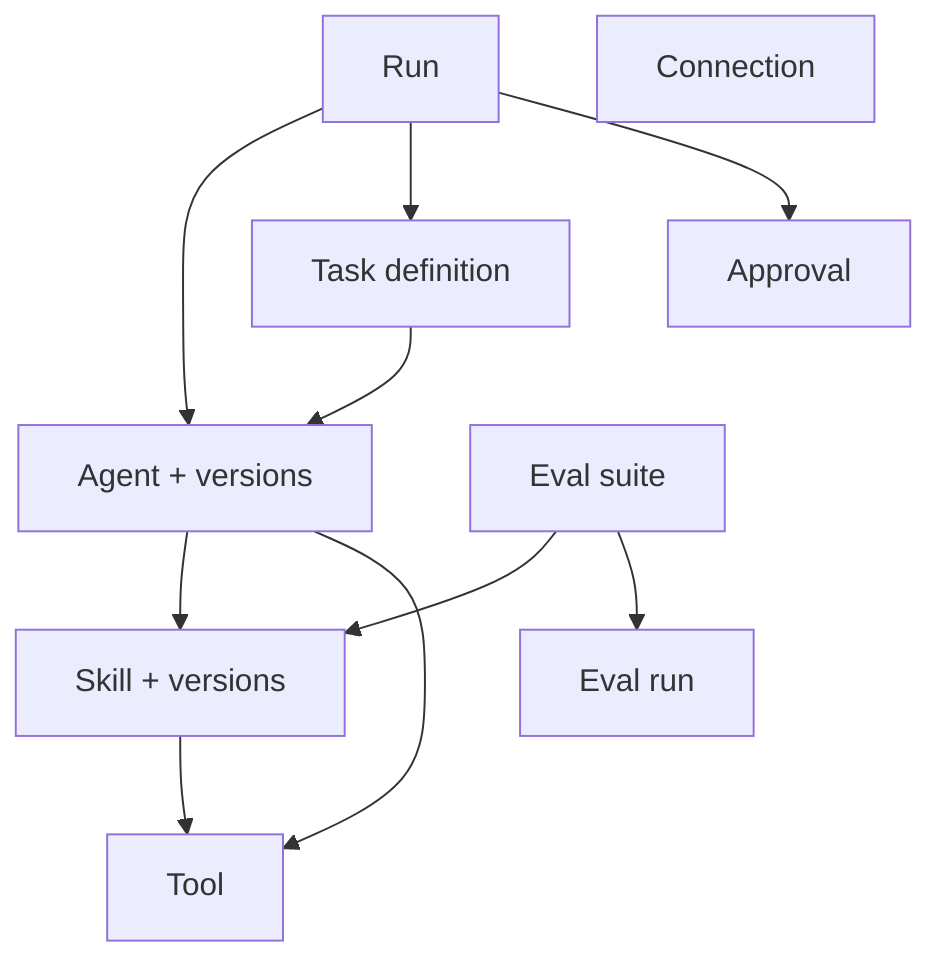

# Studio Agents platform — reference

Companion to [SKILL.md](SKILL.md). **Frontend** tables use paths relative to `apps/studio-frontend/` unless noted. **Backend** sections use paths relative to repo root (`apps/studio-backend/...`).

## Route → page file → feature component

| URL | App Router file | Feature component / notes |
|-----|-----------------|----------------------------|
| `/agents` | `app/(app)/agents/page.tsx` | `AgentListPage` |
| `/agents/new` | `app/(app)/agents/new/page.tsx` | `CreateAgentPage` + `RequirePermission` `canEditAgents` |
| `/agents/[id]` | `app/(app)/agents/[id]/page.tsx` | `AgentBuilderPage` (`agentId`), `Suspense` |
| `/skills` | `app/(app)/skills/page.tsx` | `SkillListPage` |
| `/skills/new` | `app/(app)/skills/new/page.tsx` | `CreateSkillPage` + `RequirePermission` `canEditSkills` |
| `/skills/[id]` | `app/(app)/skills/[id]/page.tsx` | `SkillBuilderPage` (`skillId`), `Suspense` |
| `/tools` | `app/(app)/tools/page.tsx` | `ToolListPage` |
| `/tools/new` | `app/(app)/tools/new/page.tsx` | `CreateToolPage` + `RequirePermission` `canEditTools` |
| `/tools/[id]` | `app/(app)/tools/[id]/page.tsx` | `ToolDetailPage` (`toolId`), `Suspense` |
| `/tasks` | `app/(app)/tasks/page.tsx` | `TaskListPage` |
| `/tasks/new` | `app/(app)/tasks/new/page.tsx` | `CreateTaskPage` + `RequirePermission` `canEditTaskDefinitions` |
| `/tasks/[id]` | `app/(app)/tasks/[id]/page.tsx` | `TaskBuilderPage` (`taskId`), `Suspense` |
| `/agents/feed` | `app/(app)/agents/feed/page.tsx` | `FeedPage` + `RequirePermission` `canViewInbox` (classic table: `InboxListPageV1`) |
| `/inbox/[threadId]` | `app/(app)/inbox/[threadId]/page.tsx` | `InboxThreadPage` + `RequirePermission` `canViewInbox`, `Suspense` |
| `/runs` | — | Redirects to `/inbox` (`next.config.ts`); no list page |
| `/runs/[id]` | `app/(app)/runs/[id]/page.tsx` | `RunDetailPage` (`runId`), `Suspense` |
| `/runs/conversations/[conversationId]` | `app/(app)/runs/conversations/[conversationId]/page.tsx` | `ConversationViewPage` |
| `/evals` | `app/(app)/evals/page.tsx` | `EvalListPage` |
| `/evals/new` | `app/(app)/evals/new/page.tsx` | `CreateEvalSuitePage` + `RequirePermission` `canEditEvals` |
| `/evals/[id]` | `app/(app)/evals/[id]/page.tsx` | `EvalSuiteEditorPage` + `RequirePermission` `canEditEvals` |
| `/evals/[id]/runs/[runId]` | `app/(app)/evals/[id]/runs/[runId]/page.tsx` | `EvalRunDetailPage` (`suiteId`, `runId`) |
| `/approvals` | — | Redirects to `/inbox` (`next.config.ts`); no list page |
| `/approvals/[id]` | `app/(app)/approvals/[id]/page.tsx` | `ApprovalDetailPage`, `Suspense` |
| `/connections` | `app/(app)/connections/page.tsx` | `ConnectionListPage` |
| `/connections/[id]` | `app/(app)/connections/[id]/page.tsx` | `ConnectionDetailPage`, `Suspense` |
| `/settings` | `app/(app)/settings/page.tsx` | `SettingsPage` |

Imports use `@/features/...` aliases. Inbox: `@/features/inbox`. Eval and approvals barrel: `@/features/evals`, `@/features/approvals`, `@/features/connections`, `@/features/settings`.

## Navigation and permission strings

Defined in `lib/navigation/nav-config.ts` (`NAV_ITEMS` and `DEV_NAV_ITEMS`).

**Primary agents-platform nav (`NAV_ITEMS`):**

| href | Label | `requiredPermissions` |
|------|-------|------------------------|
| `/agents` | Agents | `agents:agents:read` |
| `/skills` | Skills | `agents:skills:read` |
| `/inbox` | Inbox | `agents:runs:read` (`badgeKey: approvals`) |
| `/connections` | Connections | `agents:connections:read` |
| `/settings` | Settings | `agents:settings:read` |

**Dev-only sidebar (`DEV_NAV_ITEMS`):** includes `/evals` (Evals) and other lab routes — see `nav-config.ts`. Routes such as `/tools`, `/tasks`, `/runs/[id]`, and `/approvals/[id]` remain deep links without their own nav entries.

## `API_ROUTES.agentsPlatform` (`lib/api/api-routes.ts`)

| Key | Purpose |
|-----|---------|
| `skills.*` | CRUD, versions, publish, archive |
| `agents.*` | CRUD, versions, publish |
| `tools.*` | CRUD, test |
| `taskDefinitions.*` | CRUD |
| `runs.*` | list, get, create, cancel, approve, deny, events (SSE/query) |
| `evalSuites.*` | CRUD, run |
| `evalRuns.*` | list, get |
| `approvals.*` | list, get |
| `connections.*` | CRUD, revoke, refresh, audit logs |

BFF mirrors these paths under `app/api/agents-platform/`.

## Server operations barrel

`services/studio-backend/operations/agents-platform/index.ts` exports functions and re-exports SDK DTO types. Domain files:

| File | Concern |
|------|---------|
| `skills.ts` | Skills and skill versions |
| `agents.ts` | Agents and agent versions |
| `tools.ts` | Tools and test |
| `task-definitions.ts` | Task definitions |
| `runs.ts` | Runs, cancel, approve, deny |
| `approvals.ts` | Pending approvals |
| `connections.ts` | Connections and audit logs |
| `evals.ts` | Eval suites and eval runs |

## Hook index (client)

Base path: `features/agents-platform/hooks/` unless noted.

| Hook module | Exports (main) |
|-------------|----------------|
| `use-agents.ts` | `useAgents`, `useAgent`, `useAgentMutations` |
| `use-agent-versions.ts` | `useAgentVersions`, `useAgentVersion` |
| `use-skills.ts` | `useSkills`, `useSkill`, `useSkillMutations` |
| `use-skill-versions.ts` | `useSkillVersions`, `useSkillVersion` |
| `use-tools.ts` | `useTools`, `useTool`, `useToolMutations` |
| `use-task-definitions.ts` | `useTaskDefinitions`, `useTaskDefinition`, `useTaskDefinitionMutations` |
| `use-runs.ts` | `useRuns`, `useRun`, `useRunMutations` (create, cancel, approve, deny) |
| `use-approvals.ts` | `useApprovals`, `useApproval`, `useApprovalMutations` |
| `use-connections.ts` | `useConnections`, `useConnection`, `useConnectionMutations` |
| `use-connection-audit-logs.ts` | `useConnectionAuditLogs` |
| `use-settings.ts` | `useSettings`, `useSettingsMutations` |
| `use-agent-permissions.ts` | `useAgentPermissions` (includes `canViewInbox` for inbox routes) |
| `create-entity-hooks.ts` | Factory for list/detail SWR keys |
| `features/evals/hooks/use-eval-suites.ts` | `useEvalSuites`, `useEvalSuite`, `useEvalSuiteMutations` |
| `features/evals/hooks/use-eval-runs.ts` | `useEvalRuns` (optional `suiteId` / `targetId`), `useEvalRun` |
| `features/runs/hooks/use-run-events.ts` | Run event stream |
| `features/approvals/hooks/use-approval-count.ts` | Badge for nav |
| `features/inbox/hooks/use-inbox-threads.ts` | Inbox thread list + filters |
| `features/inbox/hooks/use-thread-detail.ts` | Thread detail (runs in conversation) |

Barrel: `features/agents-platform/hooks/index.ts` re-exports platform hooks (not all eval/run-specific hooks).

## Cross-feature dependencies (examples)

- **`features/runs/components/new-run-dialog.tsx`** — `useAgents`, `useTaskDefinitions`, `useRunMutations`; navigates to `/inbox/{threadId}` after create.
- **Skill builder evals tab** — `features/agents-platform/components/skills/tabs/evals-tab.tsx` ties skills to eval suites (see imports in that file).
- **Run detail / approvals** — `useRunMutations` approve/deny also invalidates approval list keys (`use-runs.ts`).
- **Eval suite editor** — uses eval hooks that reuse `createEntityHooks` from agents-platform.

## Domain relationships (refactor guide)

- **Skill** — Owns versions; manifest can reference **tools**; publish/archive; optional link to **eval** workflows via UI tabs.
- **Agent** — Owns versions; manifest attaches **skills** and **tools**; tabs cover identity, routing, memory, observability, run defaults, etc.
- **Task definition** — Targets an **agent**; schedules, triggers, retries, optional **approvals** tab for human gates.
- **Run** — Created with **agent** (+ optional **task definition**, conversation); timeline events; **approve**/**deny** surfaces pending **approval** records.
- **Eval suite** — Configures eval against agent/skill context; **eval runs** nested under `/evals/[id]/runs/[runId]`.
- **Connection** — Tenant integration; **revoke**/**refresh**; **audit logs** via dedicated hook.
- **Settings** — Tenant-level models/policies; consumed by agent behavior (coordinate with backend settings API).

## Skills: list, create, detail (frontend)

Companion mental model for `/skills` (contrast with Fleet-style card grid + modal + side drawer in external references).

### Routes and components

| URL | App Router | Feature component |
|-----|------------|-------------------|
| `/skills` | `app/(app)/skills/page.tsx` | `SkillListPage` |
| `/skills/new` | `app/(app)/skills/new/page.tsx` | `RequirePermission` (`canEditSkills`) → `CreateSkillPage` |
| `/skills/[id]` | `app/(app)/skills/[id]/page.tsx` | `Suspense` → `SkillBuilderPage` |

Implementation: `features/agents-platform/components/skills/`.

### List

- **Hook**: `useSkills` (`createEntityHooks`) → `GET` `API_ROUTES.agentsPlatform.skills.list` → BFF `app/api/agents-platform/skills/route.ts` → `listSkills` → SDK.
- **UI**: `EntityList` (searchable table): Name, Description, Created. Row click → `router.push(/skills/{id})`. Primary action → `/skills/new`.

### Create

- **Form**: `createSkillSchema` — `name` (required), optional `description` only (`create-skill-page.tsx`). No instructions body on create.
- **Submit**: `useSkillMutations().create` → `POST` same BFF route → `createSkill`.
- **After success**: toast + navigate to `/skills/{id}` so the **draft manifest** is edited on the builder.

### Detail (builder)

- **Hook**: `useSkill(skillId)`; `latestVersion.manifest` seeds the form.
- **Shell**: `BuilderShell` — breadcrumbs, tabs, `SkillActionsBar` when `canEditSkills`.
- **Tabs**: Overview, Instructions, Tools, Policies, Evals (`skill-builder-page.tsx`).
- **Form**: `skillManifestSchema` via `FormProvider`; `buildDefaultValues` maps manifest → form.
- **Save draft**: `SkillActionsBar` → `updateDraft(skillId, { name, description, manifest })` → `PUT` `API_ROUTES.agentsPlatform.skills.updateDraft` → BFF `app/api/agents-platform/skills/[id]/draft/route.ts`.

### Instructions tab

- Fields: `spec.instructions.system` and `spec.instructions.developer` (plain textareas).
- “Preview” is a read-only monospace block (`whitespace-pre-wrap`), **not** rendered Markdown.
- **No** in-UI file tree or multi-file explorer today.

### Manifest note

- `skillManifestSchema` allows optional `spec.workspace` with `layout: 'skill_md_v1'` and `root` — reserved for a possible multi-file SKILL layout; **not** wired in the UI until backend/storage exists.

### Agents (same pattern)

- `/agents/new` → create form; `/agents/[id]` → `AgentBuilderPage` + `BuilderShell` + tabs. A future shared drawer or MD preview component can attach to either skills or agents using the same phased approach below.

## Fleet-style drawer: phased decision (optional)

If product wants a **generic drawer** with directory explorer and Markdown **Preview / Source** (as in external Fleet-style references), split delivery:

1. **Phase 1 — UI-only, no new backend**  
   - Build reusable UI (e.g. drawer + **Markdown** preview vs source) over **existing** persisted fields (`spec.instructions.*` for skills; analogous agent manifest strings).  
   - Continue persisting through **`updateDraft`** (skills) or the agent equivalent.  
   - **No** multi-file listing, **no** new studio-backend endpoints.

2. **Phase 2 — Multi-file `skill_md_v1` (or agent package) bundle**  
   - Add storage + **API** for file trees (upload, CRUD blobs, or git refs).  
   - Align with `spec.workspace` and runtime expectations.  
   - Only after Phase 1 unless product explicitly skips single-surface MD authoring.

## Tasks route (same platform)

`/tasks` is part of Agents platform navigation and shares `features/agents-platform` hooks and `API_ROUTES.agentsPlatform.taskDefinitions`. When tracing **agent → scheduled work → run**, include task definition pages.

---

## `apps/studio-backend` — HTTP controllers (Agents platform)

Paths relative to `apps/studio-backend/src/api/controllers/`.

| ApiTags | Base path | Controller file |
|---------|-----------|-----------------|
| `agents` | `v1/agents` | `agents/agents.controller.ts` |
| `skills` | `v1/skills` | `skills/skills.controller.ts` |
| `tools` | `v1/tools` | `tools/tools.controller.ts` |
| `task-definitions` | `v1/tasks` | `task-definitions/task-definitions.controller.ts` |
| `runs` | `v1/runs` | `runs/runs.controller.ts` |
| `approvals` | `v1/approvals` | `approvals/approvals.controller.ts` |
| `eval-suites` | `v1/eval-suites` | `evals/eval-suites.controller.ts` |
| `eval-runs` | `v1/eval-runs` | `evals/eval-runs.controller.ts` |
| `connections` | `v1/connections` | `connections/connections.controller.ts` |
| `settings` | `v1/settings` | `settings/settings.controller.ts` |

Approve/deny run actions are implemented on **`RunsController`** (mediator commands under `application/approvals/commands`), not only on `ApprovalsController` (list/get pending approvals).

REST inventory (historical spec): [`apps/studio-backend/docs/development-plan/03-control-plane-api/plan.md`](apps/studio-backend/docs/development-plan/03-control-plane-api/plan.md).

## `apps/studio-backend` — Application layer ↔ domain entities

Application folders under `apps/studio-backend/src/application/`. Entities under `apps/studio-backend/src/domain/entities/`.

| `application/` domain | Primary entities (persistence) | Notes |
|----------------------|--------------------------------|--------|
| `agents` | `agent.entity`, `agent-version.entity` | CRUD, versions, publish |
| `skills` | `skill.entity`, `skill-version.entity` | CRUD, versions, publish, archive |
| `tools` | `tool.entity` | CRUD, test |
| `task-definitions` | `task-definition.entity` | CRUD |
| `runs` | `run.entity`, `run-event.entity` | Create/cancel/events; status updates |
| `approvals` | `approval.entity` | Pending list, get; approve/deny tied to runs |
| `evals` | `eval-suite.entity`, `eval-run.entity` | Suites + eval runs |
| `tenant-policy` | `tenant-policy.entity` | `SettingsController` GET/PUT `v1/settings/policy` |

**Connections** — `application/connections/` exports DTO types; **`ConnectionsController`** calls **`ToolGatewayClient`** (`infra/services/tool-gateway.client.ts`) — no connection row entity in this service; upstream is **tool-gateway-service** / `@agorareal/tool-gateway-service-client-sdk`.

## `apps/studio-backend` — Infra services (Agents platform–related)

Registered in [`studio-backend.module.ts`](apps/studio-backend/src/studio-backend.module.ts). One-line roles:

| Provider | Role |
|----------|------|
| `ToolGatewayClient` | Proxy for connection CRUD, refresh, revoke, audit logs to tool-gateway-service |
| `MemoryServiceClient` | Agent memory / external memory API integration |
| `WorkflowBridgeService` | Bridges runs/workflows to external execution |
| `EvalRunnerService` | Eval suite execution orchestration |
| `ApprovalExpiryScheduler` | Scheduled approval expiry |
| `RunsGateway` | Realtime channel for runs (WebSocket gateway) |

## Full-stack trace (end to end)

1. **UI** — `apps/studio-frontend/app/(app)/.../page.tsx` → feature component.
2. **Data** — SWR hook → `apiClient` + `API_ROUTES.agentsPlatform.*`.
3. **BFF** — `apps/studio-frontend/app/api/agents-platform/**/route.ts`.
4. **Server caller** — `apps/studio-frontend/services/studio-backend/operations/agents-platform/*.ts`.
5. **SDK** — `@agorareal/studio-backend-client-sdk` → HTTP to studio-backend.
6. **API** — `apps/studio-backend` controller `v1/...` → `Mediator.execute(Command|Query)`.
7. **Handler** — `apps/studio-backend/src/application/<domain>/commands|queries/...`.
8. **Persistence / side effects** — Sequelize entities, or **ToolGatewayClient** for connections.
