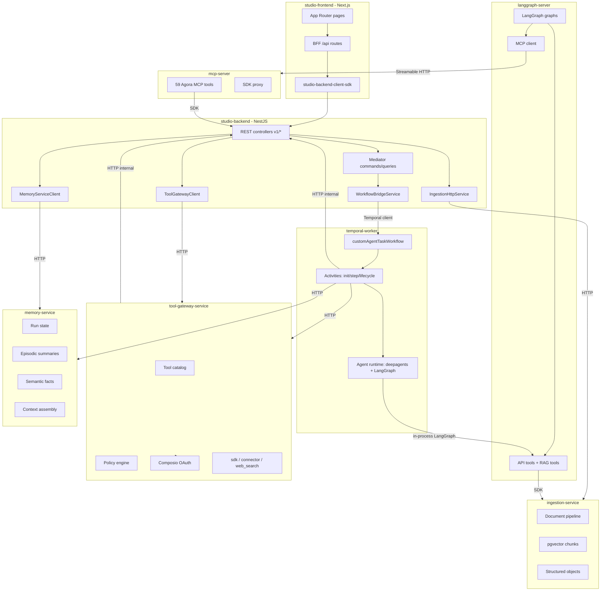

# Studio Ecosystem

## When to use

Apply when work touches **any** part of the Studio platform across these 8 apps/services, or when you need to understand how they connect. For agents-platform-specific UI/CQRS details (frontend hooks, BFF, backend controllers), also read the [studio-agents skill](../studio-agents/SKILL.md).

## System overview

## Apps and services at a glance

| App                      | Path                                 | Port | Role                                                               |
| ------------------------ | ------------------------------------ | ---- | ------------------------------------------------------------------ |
| **studio-backend**       | `apps/studio-backend`                | 3001 | Control plane: REST API, CQRS, Temporal client, Sequelize/Postgres |
| **studio-frontend**      | `apps/studio-frontend`               | 3000 | Next.js App Router, BFF, SWR, shadcn UI                            |
| **langgraph-server**     | `apps/langgraph-server`              | 2024 | Dev-only LangGraph references (`preprocess-rag`, `lpa2waterfall`)  |
| **temporal-worker**      | `apps/temporal-worker`               | —    | Temporal worker: agent runs, evals, webhooks, publish              |
| **mcp-server**           | `apps/mcp-server`                    | 8081 | MCP protocol server: 59 Agora API tools via SDK                    |
| **tool-gateway-service** | `apps/services/tool-gateway-service` | 9010 | Tool catalog, invoke, Composio OAuth, policy engine                |
| **memory-service**       | `apps/services/memory-service`       | 9011 | Agent memory: run state, summaries, semantic facts                 |
| **ingestion-service**    | `apps/services/ingestion-service`    | 9000 | Document ingestion, pgvector RAG, structured objects               |

## Shared contracts

- **`@agorareal/agents-contracts`** — `DispatchRunPayload`, `RunState`, `RunOutcome`, workflow type/signal constants, eval payloads. Used by studio-backend, temporal-worker, and tool-gateway.
- **Client SDKs** — Each service generates an OpenAPI client SDK (e.g. `@agorareal/studio-backend-client-sdk`, `@agorareal/tool-gateway-service-client-sdk`, `@agorareal/memory-service-client-sdk`). Never hand-edit these.
- **Agora domain SDKs** — `@agorareal/crm-client-sdk`, `documents-client-sdk`, `invest-client-sdk`, etc. Used by mcp-server, langgraph-server, and tool-gateway to call agora-api v2.

## Cross-service request flows

### Agent run lifecycle (the hot path)

1. **Frontend** → BFF → studio-backend `POST v1/runs` → `CreateRunCommand`
2. **studio-backend** → `WorkflowBridgeService.startTask()` → Temporal `customAgentTaskWorkflow`
3. **temporal-worker** → `initCustomAgentRun` activity → memory-service `assembleContext` + `updateRunState`
4. **temporal-worker** → `customAgentStep` loop: build agent graph (deepagents + LangGraph in-process), stream tokens → studio-backend internal events
5. **Tool calls** → tool-gateway `POST v1/tools/invoke` → policy check → adapter (sdk/connector/web_search) → Agora API or Composio
6. **Approval interrupts** → tool-gateway creates approval via studio-backend internal API → Temporal signal wait
7. **Completion** → memory-service `createRunSummary` → studio-backend `updateRunStatus` → optional webhook delivery workflow

### LangGraph reference flows

`apps/langgraph-server` is kept for local development/reference only. It no longer
hosts Studio MCP chat or document RAG production flows; active agent execution runs
through `temporal-worker`.

### Document RAG flow

1. **studio-backend** → `SyncUserDocumentsToIngestion` → ingestion-service `POST /ingest`
2. **ingestion-service** → BullMQ job → fetch from documents-service → extract text → chunk → embed (OpenAI) → pgvector
3. **langgraph-server** `ingestion-rag` graph → `IngestionClient.searchChunks` → vector similarity search

## Key patterns for building new features

### Adding a new CQRS command/query to studio-backend

See the [create-command](../create-command/SKILL.md) or [create-query](../create-query/SKILL.md) skills.

### Adding a new LangGraph tool

See the [langgraph-tools](../langgraph-tools/SKILL.md) skill.

### Adding a new MCP tool to mcp-server

1. Create `src/tools/<domain>/<tool-name>/` with `*.input.ts` (Zod), `*.output.ts`, `*.tool.ts`
2. Use `defineAgoraTool({ key, name, description, authMode, riskLevel, execute })`
3. Register in domain barrel `src/tools/<domain>/index.ts`
4. Registry picks it up from `AgoraToolRegistryService`

### Adding a new Temporal workflow

1. Implement in `apps/temporal-worker/src/domains/<domain>/workflows/`
2. Export from `src/domains/workflows.ts`
3. Activities in `src/domains/<domain>/activities/`, re-export from `src/domains/index.ts`
4. Add caller in studio-backend `WorkflowBridgeService`

### Adding a new tool-gateway connector

1. Add connector definition in `src/domain/connectors/`
2. Register in `ConnectorRegistry`
3. If custom adapter logic needed, implement `IToolAdapter` in `src/infra/adapters/`

### Wiring a new frontend feature end-to-end

1. **Backend**: Controller endpoint + CQRS handler + entity (if new data)
2. **SDK**: Regenerate `studio-backend-client-sdk`
3. **BFF**: Route handler in `app/api/agents-platform/`
4. **Operations**: Thin wrapper in `services/studio-backend/operations/agents-platform/`
5. **API_ROUTES**: Add key in `lib/api/api-routes.ts`
6. **Hook**: SWR hook using `createEntityHooks` pattern
7. **UI**: Feature component in `features/agents-platform/`

## Further detail

- **Per-service architecture and entities** — [reference.md](reference.md)
- **Cross-service integration details and data flows** — [service-integration.md](service-integration.md)
- **Agents platform UI/CQRS specifics** — [studio-agents skill](../studio-agents/SKILL.md) and its [reference.md](../studio-agents/reference.md)
