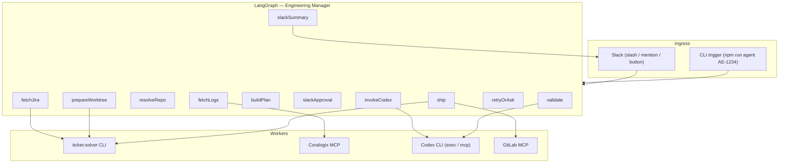

# AI Dev Agent V1 — Implementation Plan

**Codex CLI implements. LangGraph orchestrates. Skills + CLIs provide integrations.**

---

## 1. Principles (non-negotiable for V1)

| Role | Owner | Responsibility |
|------|--------|----------------|
| **Engineering manager** | LangGraph agent | Context, routing, approvals, retries, validation, Slack, MR |
| **Developer** | Codex CLI | Read repo, explore, edit code, run commands inside its sandbox |
| **Integrations** | Existing skills / CLIs / MCP | Jira (`ticket-solver`), Coralogix MCP, GitLab MCP, worktree scripts |

### Explicitly out of scope for V1

- Custom code editing, AST patching, or patch application
- Repository indexing / `find` + LLM file discovery
- LangGraph generating implementation patches

### Core rule

The agent **never directly edits source code** in V1. Only Codex CLI edits code.

The agent owns orchestration, context, approvals, retries, validation, Slack decisions, and MR creation.

---

## 2. Architecture

```
Slack / CLI
   ↓
LangGraph AI Dev Agent
   ↓
Jira + Coralogix + repo routing + approvals
   ↓
Codex CLI
   ↓
lint / tests / fixes
   ↓
apply changes + push + draft MR
```



**Data flow (one ticket run):**

```
Slack/CLI → LangGraph → Jira + Coralogix + repo routing → plan → Slack approve
  → Codex CLI (implement) → lint/tests (orchestrator) → retry Codex if red
  → ticket-solver branch + git push + GitLab draft MR → Slack summary
```

---

## 3. Agent flow (13 steps)

1. Receive ticket key, for example `AE-1234`
2. Fetch full Jira ticket details using `ticket-solver --get-jira` (see **ticket-solver-investigate** skill)
3. Fetch related Coralogix / log context if available (Coralogix MCP)
4. Resolve repo:
   - client repo or server repo
   - base branch
   - target local path
   - suggested branch name
5. Create or prepare isolated working directory / worktree
6. Build implementation plan (LangGraph LLM — manager hat only, no code edits)
7. Ask human approval through Slack before implementation
8. After approval, invoke Codex CLI with:
   - Jira ticket
   - acceptance criteria
   - Coralogix logs
   - repo path
   - base branch
   - coding rules
   - lint command
   - test command
   - instruction to iterate until green
9. Run validation:
   - lint
   - unit tests
   - relevant e2e tests when available
10. If validation fails:
    - send failure output back to Codex CLI
    - retry up to configured max attempts
11. If Codex is blocked:
    - ask a concise question in Slack
    - wait for human answer
    - continue with that answer
12. When ready:
    - use **ticket-solver-ship** skill conventions
    - create branch using slug convention
    - commit changes
    - push branch
    - open draft MR (GitLab MCP)
13. Post final Slack summary with:
    - ticket key
    - branch
    - MR link
    - files changed
    - tests / lint status
    - open risks

---

## 4. Current repo gaps

`src/dev-agent.ts` is a useful skeleton but violates V1 rules in two places:

1. **`investigate` node** — runs `find` + LLM file discovery → **remove**; Codex explores the repo.
2. **`humanApproval`** — stdin `y/n` → **replace** with Slack interactive approval.
3. **`approvedNode`** — placeholder → **replace** with Codex invoke + validation loop + ship.

`src/index.ts` (LLM patch generator) is not part of this product; archive or delete.

---

## 5. LangGraph state schema

```typescript
// Proposed state (extend Annotation.Root)
{
  // Input
  jiraIssueKey: string;           // "AE-1234"
  triggerSource: "slack" | "cli";
  slackChannelId?: string;
  slackThreadTs?: string;

  // Jira (from ticket-solver --get-jira)
  jiraJson: object;
  jiraSummary: string;
  acceptanceCriteria: string;
  suggestedBranch?: string;
  coralogixUrls: string[];

  // Repo routing (from ticket-solver JSON + config)
  scope: "client" | "server" | "both";
  clientPath?: string;            // absolute or "N/A"
  serverPath?: string;
  clientBase?: string;
  serverBase?: string;
  activeRepoPath: string;         // worktree used for this run
  branchName: string;             // {GIT_USER_PREFIX}/{KEY}-{slug}

  // Context passed to Codex
  coralogixContext: string;
  codingRules: string;            // AGENTS.md + relevant .cursor/skills excerpts
  lintCommand: string;
  testCommand: string;
  e2eCommand?: string;

  // Plan & approval
  implementationPlan: string;
  approvalStatus: "pending" | "approved" | "rejected";
  humanAnswers: Array<{ question: string; answer: string }>;

  // Codex session
  codexThreadId?: string;
  codexAttempts: number;
  maxCodexAttempts: number;       // e.g. 3
  codexLastOutput: string;

  // Validation
  lintResult: { ok: boolean; output: string };
  testResult: { ok: boolean; output: string };
  e2eResult?: { ok: boolean; output: string };

  // Ship
  filesChanged: string[];
  commitSubjects: string[];
  mrUrls: string[];
  openRisks: string[];

  // Terminal
  status: "running" | "blocked" | "shipped" | "failed";
  error?: string;
}
```

Persist state per run (SQLite or JSON under `.agent-runs/`) keyed by `jiraIssueKey + threadTs` so Slack replies and Codex retries can resume.

---

## 6. Graph nodes

### `fetchJira` (steps 1–2)

- **Tool:** `ticket-solver --get-jira <KEY> [--json]`
- **Config:** `~/.ticket-solver-skill.env`
- Parse: summary, description, acceptance criteria, comments, `suggestedBranch`, Coralogix URLs, component hints (client vs server).
- Aligns with **ticket-solver-investigate** skill.

### `fetchLogs` (step 3)

- If `coralogixUrls` or links in Jira JSON → Coralogix MCP (`read_dataprime_intro_docs` first, then query).
- If none → set `coralogixContext = ""` and continue.
- Cap output size (e.g. 8–12k chars) before passing to Codex.

### `resolveRepo` (step 4)

- **Inputs:** Jira component / labels, env defaults, optional Slack override (`client: /abs`, `server: /abs`).
- **Outputs:** `scope`, paths, merge bases (`git -C <root> rev-parse --abbrev-ref HEAD` unless overridden).
- **Branch name:** `{GIT_USER_PREFIX}/{KEY}-{slug}` from ticket-solver JSON rules.
- Encode rules from **ticket-solver-paths** skill:
  - Client bases: `development` | `master` | `release/*`
  - Server bases: `development` | `main` | `release/*`

### `prepareWorktree` (step 5)

- `ticket-solver <KEY> --client-branch <abs> --client-base <base>` (and/or server flags).
- Copy env: `copy-worktree-deps.mjs` (see **copy-worktree-dependencies** skill).
- Set `activeRepoPath` to the worktree / branch directory Codex will use (`codex -C <path>`).

### `buildPlan` (step 6)

- LangGraph LLM node (manager only): synthesize plan from Jira + logs + scope + repo conventions.
- **Output:** root cause hypothesis, files / areas (hypothesis only), steps, test plan, risks / questions.
- **Does not** read the codebase with `find` or propose patches.

### `slackApproval` (step 7)

- Post to Slack thread: ticket link, summary, Coralogix snippet, repo / branch / base, plan, risks.
- Buttons: **Approve** | **Reject** | **Ask question**
- Interrupt graph until callback (LangGraph `interrupt()` or poll + checkpoint resume).
- CLI mode: fallback to `y/n` prompt for local dev.

### `invokeCodex` (step 8)

- **Only after approval.**
- Build structured prompt containing:
  - Jira ticket + acceptance criteria
  - Coralogix context
  - Repo path, base branch, branch name (already checked out)
  - Coding rules (`AGENTS.md`, relevant skill paths)
  - Lint / test / e2e commands
  - Instruction: implement the fix; iterate until lint and tests pass; do not open MR

**Recommended invocation (V1):**

```bash
codex exec \
  --json \
  --full-auto \
  -C "$activeRepoPath" \
  -s workspace-write \
  - < prompt.md
```

- Use `--json` for structured events (files changed, command output).
- For multi-turn retries, prefer **`codex mcp`** + `codex-reply` with stored `codexThreadId`.

### `validate` (step 9)

- Orchestrator runs (not Codex), in `activeRepoPath`:
  - `lintCommand`
  - `testCommand` (unit; scope from plan)
  - `e2eCommand` when configured
- Capture stdout / stderr; set `lintResult` / `testResult`.

### `retryOrAsk` (steps 10–11)

```
if all green → ship
if attempts < max && failure is fixable → invokeCodex with failure output
if blocked / ambiguous → slackQuestion → wait → invokeCodex with answer
else → failed + slackSummary
```

Pass validation failures back to Codex verbatim:

> Lint failed:
> ```
> ...
> ```
> Fix and re-run. Do not change unrelated files.

### `ship` (step 12)

Follow **ticket-solver-ship** skill:

1. `git status` / diff → `filesChanged`
2. `git add` (ticket files only)
3. `git commit` — `fix(client): <slug> [KEY]` / `fix(server): ...`
4. `git push -u origin <branchName>`
5. GitLab MCP `create_merge_request` — title `Draft: fix(...): ... [KEY]`, Jira link in description
6. `ticket-solver --jira-code-review <KEY>`

LangGraph never edits source — only git / MR operations on Codex-produced changes.

### `slackSummary` (step 13)

Post: ticket key, branch, draft MR link(s), files changed, lint / unit / e2e status, open risks.

---

## 7. Slack integration

| Piece | Choice |
|-------|--------|
| App | Slack Bolt (Node) or Socket Mode |
| Trigger | `/dev-agent AE-1234` or `@DevAgent solve AE-1234` |
| Approvals | Block Kit buttons → webhook → resume graph |
| Questions | Thread reply → route to waiting run via `threadTs` |
| Auth | Bot token + signing secret in `.env` |

**Message contract:**

```
@DevAgent solve AE-1234
@DevAgent solve AE-1234 client: /abs/path server: N/A
```

Maps to the same graph entry as `npm run agent -- AE-1234`.

---

## 8. Repo / command configuration

Per-repo config (e.g. `~/.ai-dev-agent/repos.json` or env):

```json
{
  "client": {
    "defaultPath": "/abs/agora-client",
    "lint": "pnpm lint",
    "test": "pnpm test:unit -- --changed",
    "e2e": "pnpm test:e2e -- --grep @smoke"
  },
  "server": {
    "defaultPath": "/abs/agora-api-monorepo",
    "lint": "pnpm nx run-many -t lint --projects=...",
    "test": "pnpm nx test <module>",
    "e2e": null
  }
}
```

**Coding rules for Codex:**

- Repo-root `AGENTS.md` (Codex native)
- Pointer list to `.cursor/skills/<module>/SKILL.md` based on Jira component / touched paths

---

## 9. Target project structure

```
ai-dev-agent/
├── docs/
│   └── v1-implementation-plan.md
├── src/
│   ├── index.ts                 # Slack app entry (or dual: cli + slack)
│   ├── graph/
│   │   ├── state.ts
│   │   ├── build-graph.ts
│   │   └── nodes/
│   │       ├── fetch-jira.ts
│   │       ├── fetch-logs.ts
│   │       ├── resolve-repo.ts
│   │       ├── prepare-worktree.ts
│   │       ├── build-plan.ts
│   │       ├── slack-approval.ts
│   │       ├── invoke-codex.ts
│   │       ├── validate.ts
│   │       ├── retry-or-ask.ts
│   │       ├── ship.ts
│   │       └── slack-summary.ts
│   ├── integrations/
│   │   ├── ticket-solver.ts
│   │   ├── coralogix.ts
│   │   ├── codex.ts
│   │   ├── gitlab.ts
│   │   └── slack.ts
│   └── config/
│       └── repos.ts
├── prompts/
│   └── codex-implement.md.hbs
└── package.json
```

---

## 10. Phased delivery

### Phase 0 — Foundations (1–2 days)

- [ ] Refactor `dev-agent.ts` into modular graph + state
- [ ] Remove `investigate` find / LLM node
- [ ] Add `ticket-solver` wrappers with typed JSON parsing
- [ ] Add config loader (repos, commands, `maxCodexAttempts`)
- [ ] Codex smoke test: `codex exec` in a temp repo with a trivial task

### Phase 1 — Core loop, CLI only (3–5 days)

- [ ] Nodes: fetchJira → resolveRepo → prepareWorktree → buildPlan → CLI approval
- [ ] invokeCodex + validate + retry loop
- [ ] Ship: commit, push, draft MR via GitLab MCP
- [ ] End-to-end on one known ticket (`AE-*`)

### Phase 2 — Slack orchestration (2–3 days)

- [ ] Bolt app, slash command, approval buttons, thread Q&A
- [ ] Checkpoint persistence for resume
- [ ] slackSummary formatting

### Phase 3 — Coralogix + polish (2 days)

- [ ] fetchLogs node + truncation
- [ ] Scope detection from Jira components
- [ ] E2E command when plan marks integration risk
- [ ] Metrics / logging (run id, durations, attempt counts)

### Phase 4 — Hardening (ongoing)

- [ ] Concurrent run locking per repo path
- [ ] Timeout budgets (Codex, tests)
- [ ] Dry-run mode (plan + approval only)
- [ ] Dashboard or log tail in Slack during long Codex runs

---

## 11. Codex integration

**V1 recommendation:** start with `codex exec --json --full-auto -C <repo>`; add `codex mcp` + `codex-reply` when retry threading matters.

| Concern | Approach |
|---------|----------|
| Auth | `CODEX_API_KEY` in CI; local uses saved CLI auth |
| Sandbox | `workspace-write` on isolated worktree only |
| Approvals inside Codex | `--full-auto` or `-a never` — orchestrator owns human gates |
| What Codex must not do | commit, push, open MR (explicit in prompt) |
| Session continuity | `codexThreadId` on retries / human answers |

**Prompt template sections:**

1. Role: "You are the implementation developer."
2. Ticket + acceptance criteria
3. Logs (trimmed)
4. Constraints: minimal diff, match conventions, no MR / git push
5. Commands to run locally
6. "Stop and report `BLOCKED: <question>`" if requirements unclear

---

## 12. Validation strategy

| Layer | Runner | On failure |
|-------|--------|------------|
| Lint | Orchestrator (`execa`) | Retry Codex with output |
| Unit tests | Orchestrator | Retry Codex |
| E2E | Orchestrator (optional) | Retry or escalate to human |
| Git clean | Orchestrator pre-ship | Fail run if no changes |

Do **not** trust Codex self-reporting "tests pass" — always run commands in the orchestrator after Codex returns.

---

## 13. Environment variables

```bash
# Orchestrator
OPENAI_API_KEY=          # LangGraph plan LLM
CODEX_API_KEY=           # Codex CLI (if separate)

# Slack
SLACK_BOT_TOKEN=
SLACK_SIGNING_SECRET=
SLACK_APP_TOKEN=         # Socket Mode

# Repo defaults
CLIENT_REPO_PATH=
SERVER_REPO_PATH=
REPO_PATH=               # legacy single-repo override

# Limits
MAX_CODEX_ATTEMPTS=3
```

Jira / Git user prefix: `~/.ticket-solver-skill.env`

---

## 14. Risks and mitigations

| Risk | Mitigation |
|------|------------|
| Codex edits wrong repo / branch | Worktree + `-C` lock; never run Codex on `main` / `development` |
| Large monorepo test time | Scoped test commands from plan; nx project targeting |
| Slack approval timeout | Reminder after N hours; auto-reject or park run |
| Codex runs unbounded | Wall-clock timeout; max attempts |
| Secrets in logs | Redact before Slack / Codex; never commit `.env` |
| Dual client + server tickets | V1: single active repo per run; split tickets or sequential runs |

---

## 15. Success criteria for V1

1. Trigger `AE-1234` from Slack or CLI.
2. Human approves plan in Slack.
3. **Only Codex** modifies source files.
4. Orchestrator runs lint + tests until green or max retries.
5. Draft MR opened with correct branch naming and Jira moved to In Code Review.
6. Slack summary includes MR link and test status.
7. No custom patch / index / AST code in `ai-dev-agent`.

---

## 16. Related skills

| Skill | Phase |
|-------|-------|
| `ticket-solver-investigate` | Jira fetch |
| `ticket-solver-paths` | Repo routing, merge bases |
| `ticket-solver-ship` | Branch, commit, push, MR, Jira status |
| `copy-worktree-dependencies` | Worktree env after `git worktree add` |

---

## 17. Immediate next step

Start **Phase 0 + Phase 1**:

1. Split `dev-agent.ts` into `graph/` modules.
2. Replace `investigate` with `resolveRepo` + `prepareWorktree` (ticket-solver).
3. Add `invokeCodex` + `validate` + conditional retry.
4. Wire `ship` to GitLab MCP per **ticket-solver-ship**.
5. Keep CLI approval until Slack lands in Phase 2.
